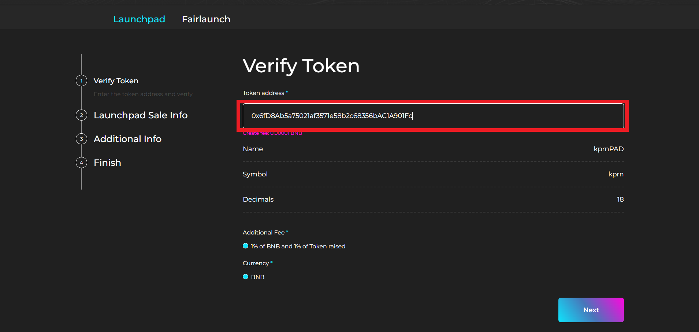
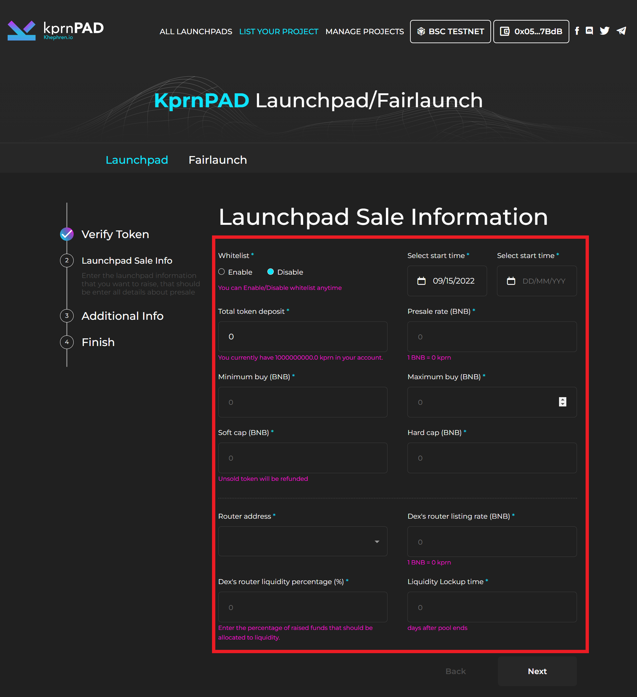
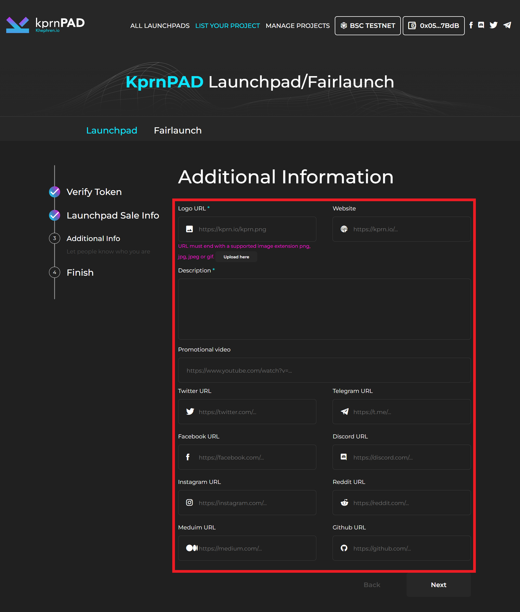
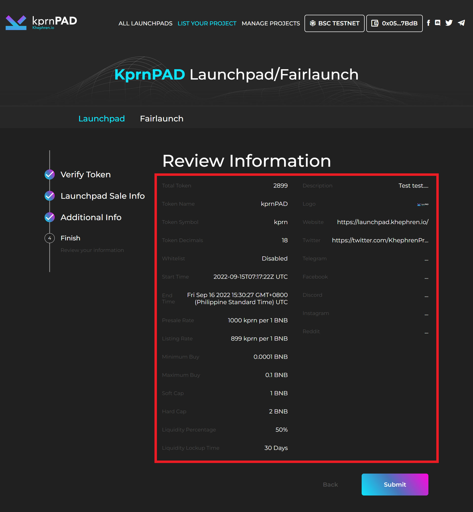
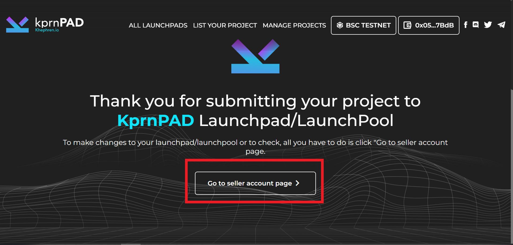

# Launchpad creation

How to list a project? Follow all the steps below to create a launchpad pool in KPRNPAD.

**STEP 1 :**  Token Smart contract verification

Copy and paste of your token smart contract to token address, once verified, click "next".\

<figure><figcaption>
 <strong></strong> Token Smart contract verification
</figcaption></figure>

**STEP 2 :** Launchpad Sale Information

Fill out all of the details for your launchpad sale, and double-check that everything is correct before hitting the "approve" button and click "confirm" on metamask wallet pop-up, then after the successful notification from metamask, click "Next button".

<figure><figcaption>
Launchpad Sale Information
</figcaption></figure>

**STEP 3 :** Additional information

Fill out all of the information about your project from logo, website, project description to social media for better sale, after that click "next".

<figure><figcaption>
Additional information
</figcaption></figure>

STEP 4 : Review Information

On this page, you will see all of the information you entered; if there is no incorrect information, click "submit." after clicking the submit button metamask wallet will ask to "confirm" the transaction.

<figure><figcaption>
Review Information
</figcaption></figure>

**STEP 5 :** Congratulations you're done to create your own launchpad pool and now you can visit your "Seller Account Page" to manage your launchpad.

<figure><figcaption>
Seller Account Page
</figcaption></figure>
