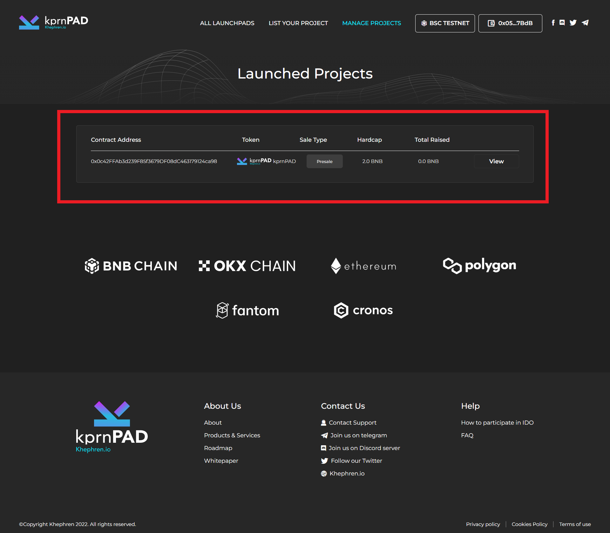

# Launchpad finalize

**To finalize the sale, go to "Manage Projects".**

<figure><figcaption></figcaption></figure>

After you clicking manage projects, you will redirect to your dashboard.

<figure><figcaption></figcaption></figure>

Click "View"

<figure><figcaption></figcaption></figure>

After clicking view you will redirect to sale page management. click "update" to go in page where you can finalize the sale.

<figure><figcaption></figcaption></figure>

Now after clicking the "update" you will see the finalize button just click that and metamask will pop.

<figure><figcaption></figcaption></figure>
