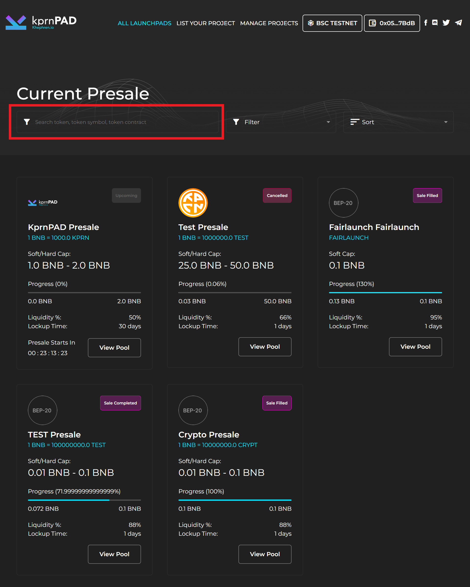
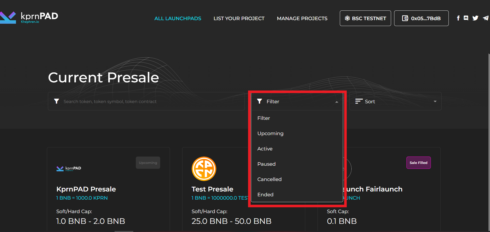
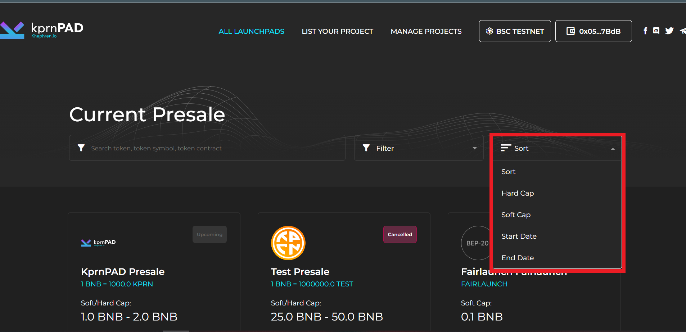
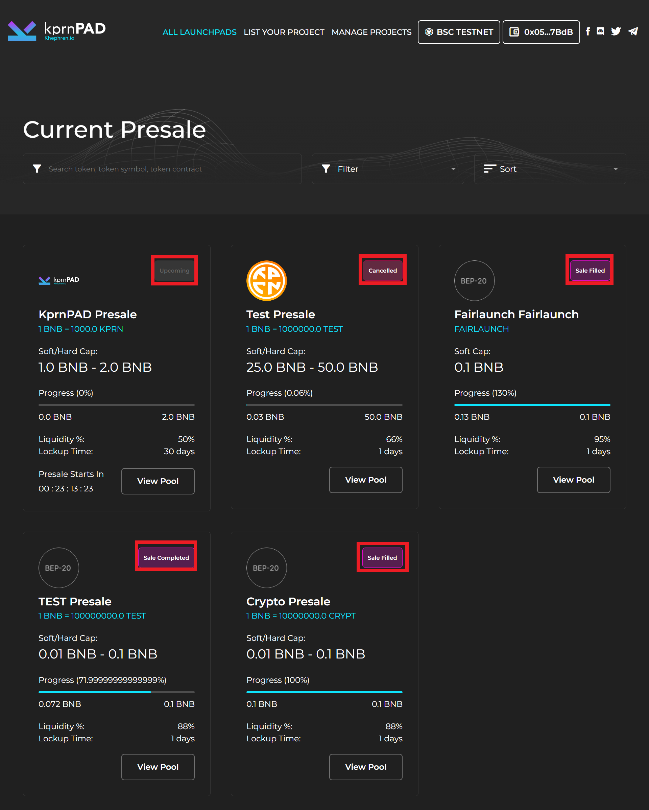

# Launchpad List

All listed projects will be visible on this page.\
\
**Features** \
\-Search\
\-Filter\
\-Sort\
\-View pool\
\-Status pool

<figure><figcaption>
<em>All project listed on the launchpad</em>
</figcaption></figure>

**View pool** - Click here to view the project sale launchpad information.

<figure><figcaption>
<strong>View pool</strong>
</figcaption></figure>

**Search** - To locate a project, enter the project's name into the search bar.&#x20;

<figure><figcaption>
<strong>Search</strong>
</figcaption></figure>

**Filter** - to maximize for choosing a project you can click the filter.

<figure><figcaption>
<strong>Filter</strong>
</figcaption></figure>

**Sort** - To filter softcap, hardcap, start date and end date click "Sort" function.

<figure><figcaption>
<strong>Sort</strong>
</figcaption></figure>

S**tatus -** To check the status of the sale you can see that on the upper right side each box on launchpad list.

<figure><figcaption>
S<strong>tatus</strong>
</figcaption></figure>
