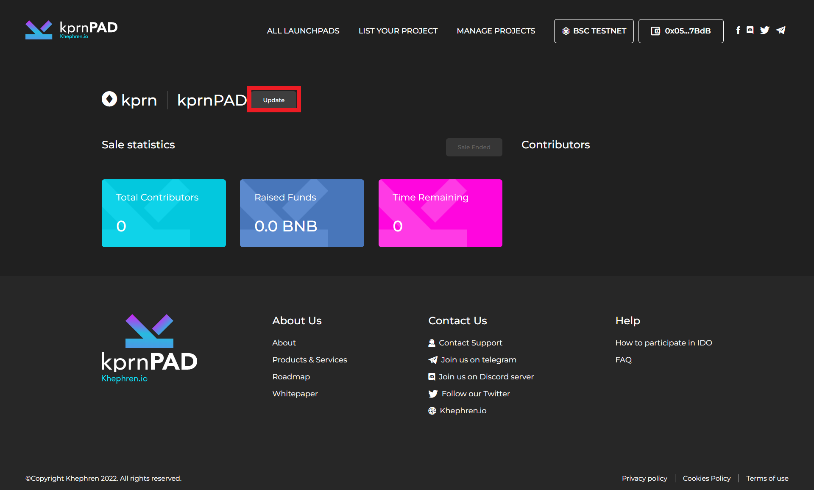

# Launchpad update

**To update the sale or edit some of information about the project under the project sale page, click "update".**

<figure><figcaption></figcaption></figure>

**After click the update, you will redirect to edit page, where you can edit the project information.**

<figure><figcaption></figcaption></figure>

**One you are done to update the project information you just need to click "Update Details"**

<figure><figcaption></figcaption></figure>

**After click submit, metamask will pop-up for the confirmation to update the project info. just click "confirm" and wait the metamask successful transaction notification.**

<figure><figcaption></figcaption></figure>

**Once done you can now go back to the "dashboard" and check your sale page.**

<figure><figcaption></figcaption></figure>
