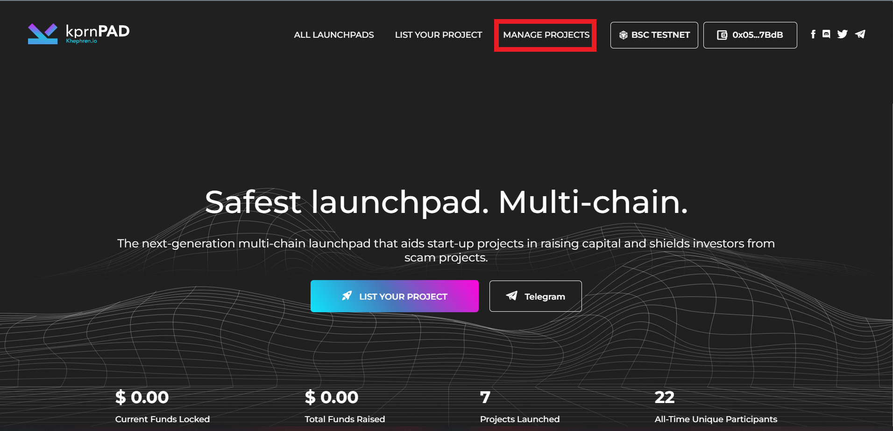
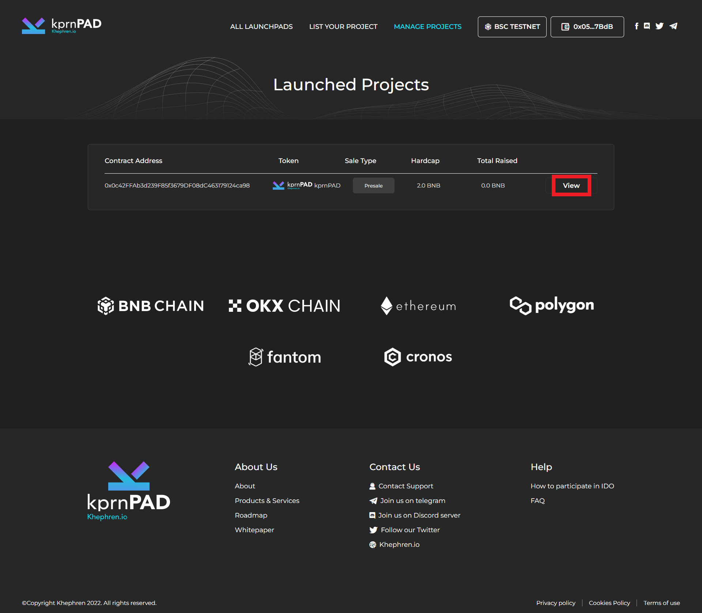

# Seller Account page

To see all the project token sales you've created, you just need to click "Manage Projects".\
\

<figure><figcaption></figcaption></figure>

<figure><figcaption></figcaption></figure>

To update or manage your sale, click "View"

<figure><figcaption></figcaption></figure>

On this image, you can see your project sale page, where you can update, edit and check the update on the sale for total raised, total contributors joined and time remaining.\

<figure><figcaption></figcaption></figure>
